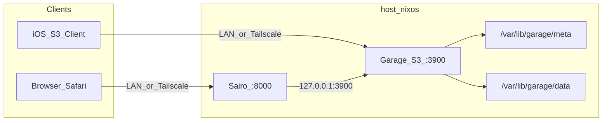
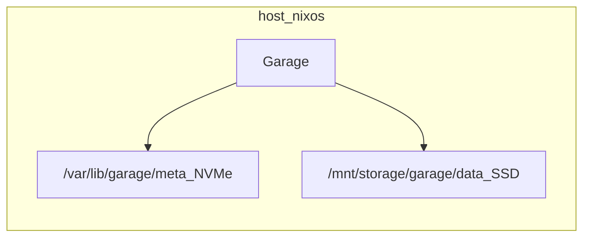

# Garage + Sairo на NixOS

Garage (S3) і Sairo (web UI) на хості `nixos`. Фаза 1: дані на системному NVMe; фаза 2: переїзд на зовнішній USB SSD.

## Архітектура

### Фаза 1 (зараз)



### Фаза 2 (переїзд на SSD)



## Шляхи та capacity

| Параметр | Фаза 1 (зараз) | Фаза 2 (переїзд на SSD) |
|----------|----------------|-------------------------|
| `metadata_dir` | `/var/lib/garage/meta` | без змін |
| `data_dir` | `/var/lib/garage/data` | `/mnt/storage/garage/data` |
| `capacity` (layout) | `200G` | `800G` |
| Mount у Nix | не потрібен | `fileSystems."/mnt/storage"` → UUID `99287b47-...` |

Змінити шлях і capacity: `let`-bindings у [`modules/services/garage.nix`](../modules/services/garage.nix).

## Nix-модулі

| Файл | Призначення |
|------|-------------|
| [`modules/services/garage.nix`](../modules/services/garage.nix) | `services.garage`, sops template `garage.toml`, firewall `:3900` |
| [`modules/services/sairo.nix`](../modules/services/sairo.nix) | Podman OCI container, sops env, firewall `:8000` |
| [`modules/roles/storage.nix`](../modules/roles/storage.nix) | Імпорт garage + sairo |
| [`secrets/garage.yaml`](../secrets/garage.yaml) | Секрети (sops + age) |

Підключення: [`hosts/nixos/default.nix`](../hosts/nixos/default.nix) імпортує `storage.nix`.

### Секрети

Файл [`secrets/garage.yaml`](../secrets/garage.yaml) шифрується через [`secrets/.sops.yaml`](../secrets/.sops.yaml):

```bash
cd secrets
SOPS_AGE_KEY_FILE=age-keys.txt sops garage.yaml   # редагувати
# або нова версія:
SOPS_AGE_KEY_FILE=age-keys.txt sops -e -i garage.yaml
```

Ключі:

- `garage-rpc-secret` — 64-char hex для `rpc_secret`
- `sairo-admin-pass`, `sairo-jwt-secret`
- `sairo-s3-access-key`, `sairo-s3-secret-key` — заповнити після bootstrap

`rpc_secret` не потрапляє в nix store: повний `garage.toml` рендериться через `sops.templates`.

### Firewall

Порти `3900` (S3) і `8000` (Sairo) відкриті лише на `enp2s0` і `wlp3s0`. `tailscale0` уже trusted у [`modules/common/default.nix`](../modules/common/default.nix). RPC/admin Garage (`3901`, `3903`) — bind на `127.0.0.1`.

## Deploy

```bash
sudo nixos-rebuild switch --flake .#nixos
```

## First-boot bootstrap (фаза 1)

Garage layout/buckets/keys не declarative — виконати один раз після deploy:

```bash
# 1. Node ID
sudo garage status

# 2. Layout (200G на NVMe)
sudo garage layout assign -z default -c 200G <NODE_ID>
sudo garage layout apply --version 1

# 3. Bucket
sudo garage bucket create media

# 4. Ключ для Sairo
sudo garage key create sairo
sudo garage bucket allow --read --write media --key sairo

# 5. Скопіювати Access Key ID + Secret у secrets/garage.yaml
cd secrets && SOPS_AGE_KEY_FILE=age-keys.txt sops garage.yaml

# 6. Перебудувати і перезапустити Sairo
sudo nixos-rebuild switch --flake .#nixos
sudo systemctl restart podman-sairo
```

Опційно: окремі read-only ключі для iOS S3-клієнтів.

## Переїзд на зовнішній SSD (фаза 2)

Зовнішній диск: SanDisk Extreme `sdb2`, UUID `99287b47-4cec-419c-85bd-686267152f99` (~829G ext4).

1. **Mount** у [`hosts/nixos/default.nix`](../hosts/nixos/default.nix):

```nix
fileSystems."/mnt/storage" = {
  device = "/dev/disk/by-uuid/99287b47-4cec-419c-85bd-686267152f99";
  fsType = "ext4";
  options = [ "noatime" ];
};
```

2. `sudo systemctl stop garage`
3. `sudo mkdir -p /mnt/storage/garage/data && sudo rsync -aHAX /var/lib/garage/data/ /mnt/storage/garage/data/`
4. У `garage.nix`: `garageDataPath = "/mnt/storage/garage/data"`, `garageDataCapacity = "800G"`
5. `sudo nixos-rebuild switch --flake .#nixos`
6. `sudo garage layout assign -z default -c 800G <NODE_ID>` → `sudo garage layout apply --version 2`
7. Перевірити S3 + Sairo; опційно видалити `/var/lib/garage/data`

Після переїзду USB SSD має бути постійно підключений — `RequiresMountsFor` блокує старт Garage без mount.

## Перевірка

| Перевірка | Команда / URL |
|-----------|---------------|
| Garage | `systemctl status garage` |
| S3 локально | `curl -s -o /dev/null -w '%{http_code}' http://127.0.0.1:3900` |
| Sairo UI | `http://<lan-ip>:8000` або `http://nixos.<tailnet>:8000` |
| Firewall | `3900`/`8000` з LAN/Tailscale, не з WAN |
| Секрети | `rpc_secret` лише в `/run/secrets` (sops template) |

## Ризики

- `replication_factor = 1` — без redundancy; потрібні зовнішні бекапи.
- Placeholder S3 keys у sops — Sairo не підключиться до Garage до завершення bootstrap.
- Sairo image pin `3.2.0` — оновлення вручну в nix config.

## Поза scope

- Reverse proxy / HTTPS
- Declarative buckets/keys (Terraform)
- Mount `/mnt/storage` у фазі 1
